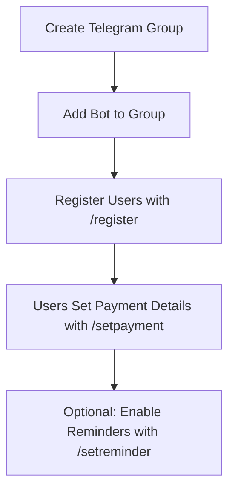

# RasWise Redux

A Telegram bot for splitting expenses among group members, built on Cloudflare Workers.

## Features

- **User Registration**: Register users in group chats to track their expenses
- **Admin Controls**: Unregister users and mark payments on behalf of others (admin only)
- **Payment Details**: Users can set and update their bank account details
- **Expense Tracking**: Add expenses with amount, description, location, and bill photos
- **Vendor Payment Slips**: Upload proof of payment to vendors/restaurants
- **Flexible Splitting**: Split bills equally or set custom amounts per person
- **Payment Tracking**: Track who owes what and mark expenses as paid with optional transfer slips
- **Comprehensive History**: View expense history with all attachments and payment records
- **Timezone Support**: Configure group-specific timezones for accurate date/time display
- **Daily Reminders**: Automatic daily reminders for pending expenses
- **Privacy First**: All personal financial information sent via DM

## Tech Stack

- **Runtime**: Cloudflare Workers (serverless at the edge)
- **Bot Framework**: grammY (web variant for Workers)
- **Database**: Cloudflare D1 (SQLite)
- **Storage**: Cloudflare R2 (for bill photos, vendor slips, transfer receipts)
- **Session Management**: Cloudflare KV
- **Language**: TypeScript with strict typing
- **Testing**: Vitest + Miniflare (92 tests, 98.44% coverage)

## Complete Bot Workflow

### 1. Initial Setup (One-time)



### 2. Adding an Expense

**Command**: `/addexpense` (in group chat)

The bot guides you through an 8-step interactive flow:

```
Step 1: Amount
├─ Enter the total expense amount (e.g., 300.00)
│
Step 2: Description (Optional)
├─ Enter a description (e.g., "Team lunch at Pizza Place")
├─ OR click "Skip"
│
Step 3: Location (Optional)
├─ Enter location (e.g., "123 Main St, Downtown")
├─ OR click "Skip"
│
Step 4: Bill Photo (Optional)
├─ Upload a photo of the receipt/bill
├─ OR click "Skip"
│
Step 5: Vendor Payment Slip (Optional)
├─ Upload proof that you paid the vendor/restaurant
├─ (e.g., bank transfer receipt, payment confirmation)
├─ OR click "Skip"
│
Step 6: Select Users
├─ Click usernames to toggle selection
├─ OR click "All Users" to select everyone
├─ Click "Continue" when done
│
Step 7: Who Paid?
├─ Select who fronted the money
├─ (This person will receive payments from others)
│
Step 8: Split Type
├─ Equal Split: Divide equally among selected users
├─ OR Custom Split: Specify amount for each person
```

**Important Notes**:
- The person who paid (Step 7) is automatically excluded from owing money
- Only the people who need to pay back are included in the split
- All photos are optional but helpful for record-keeping

**Example**:
```
Scenario: Team lunch costs 300, Alice paid, splitting with Bob and Charlie

Step 1: 300
Step 2: Team lunch
Step 3: Pizza Place
Step 4: [uploads bill photo]
Step 5: [uploads bank transfer to restaurant]
Step 6: Select Alice, Bob, Charlie → Continue
Step 7: Select "Alice" (who paid)
Step 8: Equal Split

Result:
- Bob owes Alice: 100
- Charlie owes Alice: 100
- Alice owes: 0 (she paid)
```

### 3. Viewing Your Expenses

**Command**: `/myexpenses` (in group or DM)

Displays two sections in your DM:

**Section A: Pending Expenses**
```
*Your Pending Expenses:*

*Expense #123*
Total amount: 300.00
Amount you owe: 100.00
Description: Team lunch
Location: Pizza Place
Bill photo: [View]
Vendor slip: [View]
Fronted by: Alice
Date: 2025/01/15

Total pending: 100.00
```

**Section B: Payment History**
```
━━━━━━━━━━━━━━━━

*Your Payment History:*

*Payment #45*
Amount paid: 50.00
Paid to: John
For: Coffee supplies
Location: Starbucks
Transfer slip: [View]
Date: 2025/01/14

Total paid: 50.00
```

### 4. Marking an Expense as Paid

**Command**: `/markpaid`

```
Step 1: Select Expense
├─ Bot shows list of your unpaid expenses
├─ Click on the expense you want to mark as paid
│
Step 2: View Payment Details
├─ Bot shows:
│   • Amount to pay
│   • Recipient's name
│   • Recipient's bank account number
│   • Expense description
│
Step 3: Make Payment
├─ Use your banking app to transfer money
│
Step 4: Confirm Payment
├─ Click "I've Paid This"
│
Step 5: Upload Transfer Slip (Optional)
├─ Upload a photo of your bank transfer receipt
├─ OR click "Skip"
│
Step 6: Confirmation
├─ Expense marked as paid
├─ Recipient gets notification
├─ Your payment recorded in history
```

### 5. Viewing Group History

**Command**: `/history` (in group chat)

Displays recent expenses in your DM:
```
*Recent Expense History:*

*Expense #123*
   Amount: 300.00
   Description: Team lunch
   Bill photo: [View]
   Vendor slip: [View]
   By: Alice | 2025/01/15
   Split: equal among 3 user(s)
   Status: 2/2 paid

*Expense #122*
   Amount: 150.00
   Description: Office supplies
   By: Bob | 2025/01/14
   Split: custom among 2 user(s)
   Status: 1/2 paid
```

### 6. Viewing Your Summary

**Command**: `/summary` (in group chat)

Shows cumulative statistics in your DM:
```
*Your Expense Summary:*

*Total Unpaid:* 150.00
*Total Paid:* 300.00
*Pending Expenses:* 3

*You owe:*
  • Alice: 100.00 (2 expenses)
  • Bob: 50.00 (1 expense)
```

### 7. Viewing Who Owes You

**Command**: `/owed` (in group or DM)

Shows money owed to you (sent via DM):
```
*Payments Owed to You:*

Total Pending: 200.00
Total Received: 500.00

*Breakdown:*

Bob:
  Amount: 100.00
  Expenses: #123, #125

Charlie:
  Amount: 100.00
  Expenses: #123, #124
```

### 8. Daily Reminders

If enabled with `/setreminder`:
```
Daily at 10:00 AM UTC:
├─ Bot checks for groups with unpaid expenses
├─ Sends reminder to each user with unpaid expenses:
│
"*Daily Reminder*

You have 2 pending expenses
Total owed: 175.00

Use /myexpenses to see details
Use /markpaid to mark as paid"
```

## Setup Instructions

### 1. Prerequisites

- Node.js 18+ installed
- A Cloudflare account
- A Telegram Bot Token (get one from [@BotFather](https://t.me/botfather))

### 2. Install Dependencies

```bash
npm install
```

### 3. Create Cloudflare Resources

#### Create D1 Database

```bash
npx wrangler d1 create raswise_db
```

Copy the database ID and update `wrangler.toml`:

```toml
[[d1_databases]]
binding = "DB"
database_name = "raswise_db"
database_id = "YOUR_DATABASE_ID_HERE"
```

#### Create Database Schema

```bash
npx wrangler d1 execute raswise_db --file=./schema.sql
```

#### Create KV Namespace

```bash
npx wrangler kv namespace create "raswise_kv"
```

Update `wrangler.toml` with the KV namespace ID:

```toml
[[kv_namespaces]]
binding = "KV"
id = "YOUR_KV_ID_HERE"
```

#### Create R2 Bucket

```bash
npx wrangler r2 bucket create raswise-bills
```

The bucket name is already configured in `wrangler.toml`.

### 4. Set Bot Token as Secret

```bash
npx wrangler secret put BOT_TOKEN
```

When prompted, paste your Telegram Bot Token.

### 5. Deploy to Cloudflare Workers

```bash
npm run deploy
```

After deployment, you'll get a worker URL like `https://raswise-redux.YOUR_SUBDOMAIN.workers.dev`

### 6. Set Up Telegram Webhook

Update `wrangler.toml` with your worker domain:

```toml
[vars]
WEBHOOK_DOMAIN = "https://raswise-redux.YOUR_SUBDOMAIN.workers.dev"
```

Then set the webhook:

```bash
curl -X POST "https://api.telegram.org/bot<YOUR_BOT_TOKEN>/setWebhook?url=https://raswise-redux.YOUR_SUBDOMAIN.workers.dev/webhook"
```

### 7. Set Up Daily Reminders (Optional)

Add a cron trigger to `wrangler.toml`:

```toml
[triggers]
crons = ["0 10 * * *"]  # Runs at 10:00 AM UTC daily
```

Redeploy:

```bash
npm run deploy
```

## Bot Commands Reference

### User Management
- `/start` - Get started and see all commands
- `/help` - Show help message with all commands
- `/register` - Register a user in the group
  - `/register` (reply to user's message)
  - `/register` (mention the user - they must be in the group)
- `/unregister` - Unregister a user from the group (admin only)
  - `/unregister` (reply to user's message)
  - `/unregister @username`
  - `/unregister username`
- `/listusers` - List all registered users in the group
- `/setpayment` - Set or update your bank account number
- `/viewpayment` - View your saved payment details

### Expense Management
- `/addexpense` - Start adding a new expense (8-step interactive flow)
- `/myexpenses` - View your pending expenses and payment history (sent via DM)
- `/summary` - View your cumulative expense summary (sent via DM)
- `/history` - View group expense history with attachments (sent via DM)

### Payments
- `/markpaid` - Mark an expense as paid with optional transfer slip
- `/adminmarkpaid` - Mark payment on behalf of another user (admin only)
- `/owed` - See who owes you money (sent via DM)

### Reminders & Settings
- `/setreminder` - Toggle daily reminders on/off for the group
- `/reminderstatus` - Check if reminders are enabled
- `/settimezone` - Set group timezone for accurate date/time display (admin only)
- `/viewtimezone` - View current group timezone

## Key Features Explained

### 📷 Three Types of Photos

1. **Bill Photo** (Step 4 of expense creation)
   - Photo of the receipt from vendor
   - Helps verify expense amount and items

2. **Vendor Payment Slip** (Step 5 of expense creation)
   - Proof that the person who fronted actually paid the vendor
   - E.g., bank transfer confirmation to restaurant
   - Shows in expense history with 🧾 icon

3. **Transfer Slip** (when marking expense as paid)
   - Proof that you paid the person who fronted
   - Shows in your personal payment history with 📷 icon
   - Recipient gets notification with attachment

### 👮 Admin Controls

Group admins (creators and administrators) have special permissions:

**Admin-Only Commands:**
- `/unregister` - Remove users from the group (only if they have no pending expenses)
  - Works with reply-to-message, @username, or plain username
  - Can unregister users even if they've left the group
- `/adminmarkpaid` - Mark payments as paid on behalf of other users
  - Requires reply-to-message pattern
- `/settimezone` - Set the group's timezone for accurate date/time display

**How to Use:**
- `/adminmarkpaid` uses reply-to-message pattern
- `/unregister` supports three formats:
  - Reply to the user's message and use `/unregister`
  - Use `/unregister @username`
  - Use `/unregister username`
- The bot will verify your admin status before executing

**Unregister Restrictions:**
- Cannot unregister users with pending unpaid expenses
- Bot will show the exact amount and number of pending expenses
- User must pay all debts before they can be unregistered

**Admin Mark Paid Flow:**
1. Reply to target user's message with `/adminmarkpaid`
2. Bot shows list of that user's pending expenses
3. Select the expense to mark as paid
4. Bot marks it paid and notifies both the payer and the user

### 🔒 Privacy Protection

All personal financial information is sent via **Direct Message** to protect user privacy:
- `/myexpenses` - Your pending debts and payment history
- `/summary` - Your financial summary
- `/owed` - Money owed to you
- `/history` - Group expense history

Only group-level actions happen in the group chat:
- User registration
- Adding expenses
- Group settings
- Admin actions

### 💡 Smart Split Logic

**The person who paid is automatically excluded from the split:**

Example with Equal Split:
```
Total: 300
Paid by: Alice
Users: Alice, Bob, Charlie (3 people)

Split calculation:
- Alice: 0 (she paid)
- Bob: 150 (300 ÷ 2)
- Charlie: 150 (300 ÷ 2)
```

Example with Custom Split:
```
Total: 300
Paid by: Alice
Users: Alice, Bob, Charlie

Custom amounts entered:
- Bob: 200
- Charlie: 100
- Alice: Not asked (she paid)
```

## Development

### Run Locally

```bash
npm run dev
```

This starts a local development server. You'll need to use a tool like ngrok to expose it to Telegram for testing.

### Run Tests

```bash
# Run all tests
npm test

# Run tests with coverage report
npm run test:coverage

# Type check
npm run typecheck
```

### Test Coverage
- **92 tests** covering all core functionality including:
  - User registration and unregistration
  - Payment details management
  - Expense creation with equal/custom splits
  - Payment tracking and history
  - Admin controls (unregister, mark paid on behalf)
  - Reminder settings and timezone management
  - Date formatting with timezone offsets
  - Session management
- **98.44% overall coverage** (100% on db.ts and utils.ts)
- Tests use actual production schema.sql
- Miniflare provides realistic Cloudflare Workers environment

### Test Breakdown
- `src/test/utils.test.ts` - 32 tests for utility functions
  - Date/datetime formatting with timezone support
  - User name formatting
  - Amount formatting
  - DM fallback handling
  - Session save/get operations
- `src/test/db.test.ts` - 39 tests for database operations
  - User CRUD operations
  - Payment details management
  - Group registration
  - Expense and split creation
  - Payment recording and history
  - Summary calculations
  - Reminder settings
  - Timezone operations
  - Unregister with validation
- `src/test/handlers.test.ts` - 21 integration tests
  - End-to-end registration flows
  - Expense creation and payment workflows
  - Summary and history generation
  - Reminder system functionality
  - Edge case handling

### Generate TypeScript Types

```bash
npm run cf-typegen
```

## Database Schema

The bot uses the following tables:

- **`users`** - Registered users with Telegram ID, username, and name
- **`payment_details`** - User payment information (bank accounts)
- **`group_users`** - User-group registration mapping
- **`expenses`** - Expense records with amount, description, location, photos
  - `photo_url` - Bill/receipt photo
  - `vendor_payment_slip_url` - Proof of payment to vendor
- **`expense_splits`** - Individual split amounts per user
- **`payments`** - Payment transaction history
  - `transfer_slip_url` - Proof of payment between users
- **`reminder_settings`** - Group reminder preferences

### Storage Structure (R2 Bucket)

```
raswise-bills/
├── bills/{groupId}/{timestamp}_{fileId}.jpg          # Bill photos
├── vendor_slips/{groupId}/{timestamp}_{fileId}.jpg   # Vendor payment proofs
└── transfer_slips/{userId}/{timestamp}_{fileId}.jpg  # User transfer receipts
```

## Architecture

```
┌─────────────────────────────────────┐
│       Telegram Bot API              │
└──────────────┬──────────────────────┘
               │
               ▼
┌──────────────────────────────────────┐
│    Cloudflare Workers                │
│    ┌─────────────────────┐          │
│    │   Bot Logic         │          │
│    │   - Command Handlers│          │
│    │   - Session Manager │          │
│    │   - Photo Processor │          │
│    └──────┬───┬───┬──────┘          │
└───────────┼───┼───┼──────────────────┘
            │   │   │
      ┌─────┘   │   └─────┐
      ▼         ▼         ▼
   ┌────┐    ┌────┐    ┌────┐
   │ D1 │    │ KV │    │ R2 │
   └────┘    └────┘    └────┘
   SQLite    Session   Photos
   Database  State     Storage
```

## Common Use Cases

### Case 1: Restaurant Bill with Multiple Diners

```
Scenario: 5 friends at dinner, Alice pays $250 bill

1. Alice: /addexpense
2. Enter: 250
3. Description: "Dinner at Italian Restaurant"
4. Upload: Photo of bill
5. Upload: Bank transfer receipt to restaurant
6. Select: All 5 friends
7. Paid by: Alice
8. Split: Equal

Result:
- Each of the other 4 friends owes Alice $62.50
- Alice owes nothing
- Everyone can see bill photo and payment proof
```

### Case 2: Shared Grocery Shopping

```
Scenario: Bob bought groceries for 3 roommates, custom split

1. Bob: /addexpense
2. Enter: 120
3. Description: "Weekly groceries"
4. Skip: location
5. Upload: Receipt photo
6. Skip: vendor slip
7. Select: Alice, Bob, Charlie
8. Paid by: Bob
9. Split: Custom
   - Alice: 40 (she requested extra items)
   - Charlie: 80 (he requested premium items)

Result:
- Alice owes Bob $40
- Charlie owes Bob $80
- Bob owes nothing
```

### Case 3: Tracking Payments

```
Scenario: Charlie paying back Bob for groceries

1. Charlie: /markpaid
2. Select: Expense #145 (Weekly groceries)
3. View: Bob's account number displayed
4. Charlie transfers $80 via banking app
5. Click: "I've Paid This"
6. Upload: Screenshot of transfer confirmation
7. Done!

Result:
- Expense marked as paid
- Bob receives notification
- Transfer slip saved in Charlie's payment history
- Charlie can view this payment in /myexpenses history section
```

## Example Bot Messages

### Starting the Bot

**User**: `/start`

**Bot**:
```
Welcome to RasWise Redux!

I help you split expenses with your friends.

Available commands:
/register - Register a user in a group
/unregister - Unregister a user (admin)
/listusers - List registered users
/setpayment - Set your payment details
/viewpayment - View your payment details
/addexpense - Add a new expense
/myexpenses - View your pending expenses
/summary - View your expense summary
/history - View group expense history
/markpaid - Mark an expense as paid
/adminmarkpaid - Mark payment on behalf of user (admin)
/owed - See who owes you money
/setreminder - Toggle daily reminders
/settimezone - Set group timezone (admin)
/viewtimezone - View current timezone
/help - Show this help message
```

### Registering a User

**Method 1: Reply to message**

**Alice**: Hi everyone!

**Bob** (replying to Alice): `/register`

**Bot**:
```
*Success:* Alice has been registered in this group!
```

**Method 2: Mention user**

**Bob**: `/register` @Alice

**Bot**:
```
*Success:* Alice has been registered in this group!
```

### Setting Payment Details

**User**: `/setpayment`

**Bot**:
```
Please send your bank account number:
```

**User**: `1234567890`

**Bot**:
```
*Success:* Your payment details have been saved!

Bank Account: 1234567890

You can update this anytime with /setpayment
```

### Adding an Expense (Full Flow)

**User**: `/addexpense`

**Bot**:
```
Step 1: Enter the total amount for this expense:
```

**User**: `300`

**Bot**:
```
Step 2: Enter a description for this expense (optional):
```

**User**: `Team lunch at Pizza Place`

**Bot**:
```
Step 3: Enter the location (optional):
```

**User**: _clicks "Skip"_

**Bot**:
```
Step 4: Send a photo of the bill/receipt (optional)
```

**User**: _uploads photo_

**Bot**:
```
Step 5: Send a photo of your payment slip to the vendor (bank transfer receipt, etc.)

(Optional - this is proof that you paid the vendor/restaurant)
```

**User**: _uploads payment slip_

**Bot**:
```
Step 6: Select the users to split this expense with:

(Click users to toggle selection, then click Continue)

[Alice] [Bob]
[Charlie] [Dave]
[All Users]
[Continue]
```

**User**: _selects Alice, Bob, Charlie, then clicks "Continue"_

**Bot**:
```
Selected 3 user(s) to split with.

Step 7: Who paid the full amount?

[Alice (You)] [Bob]
[Charlie]
```

**User**: _clicks "Alice (You)"_

**Bot**:
```
Paid by: Alice

Step 8: How should the bill be split?

[Equal Split]
[Custom Split]
```

**User**: _clicks "Equal Split"_

**Bot**:
```
*Success:* Expense added successfully!

*Total Amount:* 300.00
*Paid by:* Alice
*Description:* Team lunch at Pizza Place

*To be paid by 2 user(s):*
  • Bob: 150.00
  • Charlie: 150.00

Expense ID: #123
```

### Viewing Pending Expenses

**User** (in group): `/myexpenses`

**Bot** (in DM to user):
```
*Your Pending Expenses:*

*Expense #123*
Total amount: 300.00
Amount you owe: 150.00
Description: Team lunch at Pizza Place
Bill photo: [View]
Vendor slip: [View]
Fronted by: Alice
Date: 2025/01/15

Total pending: 150.00

Use /summary for a cumulative summary
Use /markpaid to mark expenses as paid
```

### Viewing Payment History

**User**: `/myexpenses`

**Bot** (in DM, showing both sections):
```
*Your Pending Expenses:*

*Expense #124*
Total amount: 50.00
Amount you owe: 25.00
Description: Coffee supplies
Fronted by: Dave
Date: 2025/01/16

Total pending: 25.00

━━━━━━━━━━━━━━━━

*Your Payment History:*

*Payment #42*
Amount paid: 150.00
Paid to: Alice
For: Team lunch at Pizza Place
Transfer slip: [View]
Date: 2025/01/15

Total paid: 150.00

Use /summary for a cumulative summary
Use /markpaid to mark expenses as paid
```

### Marking an Expense as Paid

**User**: `/markpaid`

**Bot**:
```
Select an expense to mark as paid:

[#124 - 25.00 (Coffee supplies)]

Showing 1 of 1 pending expenses.
Use /myexpenses to see all.
```

**User**: _clicks on the expense_

**Bot**:
```
*Payment Details for Expense #124:*

Amount to pay: 25.00
For: Coffee supplies

Pay to: Dave
Bank Account: 9876543210

Once you've paid, click the button below to mark as paid.

[I've Paid This]
[Cancel]
```

**User**: _transfers money and clicks "I've Paid This"_

**Bot**:
```
Would you like to upload a bank transfer slip as proof of payment?

You can send a photo now, or click Skip to mark as paid without a receipt.

[Skip]
```

**User**: _uploads transfer slip photo_

**Bot**:
```
*Success:* Payment marked as complete!

Expense #124
Amount: 25.00
Description: Coffee supplies

Transfer slip uploaded

The person who paid has been notified.
```

**Bot** (notification to Dave):
```
*Success:* Bob marked their payment as paid!

Expense #124
Amount: 25.00
Description: Coffee supplies

Transfer slip: [View]
```

### Viewing Summary

**User** (in group): `/summary`

**Bot** (in DM):
```
*Your Expense Summary:*

*Total Unpaid:* 75.00
*Total Paid:* 150.00
*Pending Expenses:* 2

*You owe:*
  • Alice: 50.00 (1 expense)
  • Dave: 25.00 (1 expense)

Use /myexpenses to see detailed breakdown
Use /markpaid to mark expenses as paid
```

### Viewing Who Owes You

**User** (in group): `/owed`

**Bot** (in DM):
```
*Payments Owed to You:*

Total Pending: 300.00
Total Received: 150.00

*Breakdown:*

Bob:
  Amount: 150.00
  Expenses: #123

Charlie:
  Amount: 150.00
  Expenses: #123
```

### Viewing Group History

**User** (in group): `/history`

**Bot** (in DM):
```
*Recent Expense History:*

*Expense #125*
   Amount: 80.00
   Description: Uber ride home
   By: Charlie | 2025/01/17
   Split: equal among 4 user(s)
   Status: 3/3 paid

*Expense #124*
   Amount: 50.00
   Description: Coffee supplies
   By: Dave | 2025/01/16
   Split: equal among 2 user(s)
   Status: 2/2 paid

*Expense #123*
   Amount: 300.00
   Description: Team lunch at Pizza Place
   Bill photo: [View]
   Vendor slip: [View]
   By: Alice | 2025/01/15
   Split: equal among 3 user(s)
   Status: 2/2 paid

Showing last 3 expenses
```

### Listing Users

**User**: `/listusers`

**Bot**:
```
*Registered Users (4):*

1. Alice
2. Bob
3. Charlie
4. Dave
```

### Setting Reminders

**User**: `/setreminder`

**Bot**:
```
*Status:* Daily reminders have been enabled for this group!

Users with pending expenses will receive a daily DM reminder.
```

**User**: `/setreminder` (again)

**Bot**:
```
*Status:* Daily reminders have been disabled for this group.
```

### Daily Reminder (Automatic)

**Bot** (at 10:00 AM UTC, if reminders enabled):
```
*Daily Reminder*

You have 2 pending expenses
Total owed: 175.00

Use /myexpenses to see details
Use /markpaid to mark as paid
```

### Unregistering a User (Admin Only)

**Method 1: Reply to message**

**Admin** (replying to Bob's message): `/unregister`

**Bot** (if user has pending expenses):
```
*Error:* Cannot unregister user. They have 2 unpaid expense(s) totaling 150.00.
```

**Admin** (after Bob pays all expenses, replies to Bob): `/unregister`

**Bot**:
```
*Success:* Bob has been unregistered from this group.
```

**Method 2: Using @username**

**Admin**: `/unregister @bob`

**Bot**:
```
*Success:* Bob has been unregistered from this group.
```

**Method 3: Using plain username (works even if user left the group)**

**Admin**: `/unregister bob`

**Bot**:
```
*Success:* Bob has been unregistered from this group.
```

**Admin**: `/unregister @alice`

**Bot** (if username not found):
```
*Error:* User @alice is not registered in this group.
```

### Setting Group Timezone (Admin Only)

**Admin**: `/settimezone`

**Bot**:
```
*Set Group Timezone*

Please enter the timezone offset from UTC.

Examples:
+5 for Maldives
-5 for Eastern US
+0 for UTC
+8 for Singapore

Just send the number (like +5 or -5)
```

**Admin**: `+5`

**Bot**:
```
*Success:* Timezone set to UTC+5

All dates in this group will now be displayed in this timezone.
```

### Viewing Group Timezone

**User**: `/viewtimezone`

**Bot**:
```
*Current Group Timezone:* UTC+5

To change the timezone, use /settimezone (admin only)
```

### Admin Marking Payment on Behalf of User

**Admin** (replying to Bob's message): `/adminmarkpaid`

**Bot**:
```
Select an expense to mark as paid for Bob:

[#123 - 150.00 (Team lunch at Piz...)]
[#124 - 25.00 (Coffee supplies)]

Showing 2 of 2 pending expenses.
```

**Admin**: _clicks on expense #123_

**Bot** (in group):
```
*Success:* Payment marked as complete for Bob!

Expense #123
Amount: 150.00
Description: Team lunch at Pizza Place
```

**Bot** (DM to Alice, who fronted the money):
```
*Success:* Admin Charlie marked Bob's payment as paid!

Expense #123
Amount: 150.00
Description: Team lunch at Pizza Place
```

**Bot** (DM to Bob):
```
*Success:* Admin marked your payment as complete!

Expense #123
Amount: 150.00
Description: Team lunch at Pizza Place
```

### Error Messages

**User tries to add expense without registration**:
```
*Error:* You must be registered in this group first.
Ask a group admin to reply to one of your messages with /register
```

**User tries to mark paid when person hasn't set payment details**:
```
*Error:* The person who paid this expense hasn't set up payment details yet.
Ask them to use /setpayment to add their payment information.
```

**Session expires**:
```
Session expired
```

**Bot can't send DM**:
```
*Error:* I couldn't send you a DM. Please start a chat with me first by clicking my name and pressing "Start".
```

## Troubleshooting

### Bot Not Responding
1. Check bot token is correctly set: `npx wrangler secret list`
2. Verify webhook is set: `curl https://api.telegram.org/bot<TOKEN>/getWebhookInfo`
3. Check worker logs: `npx wrangler tail`

### Database Errors
1. Ensure schema is initialized: `npx wrangler d1 execute raswise_db --file=./schema.sql`
2. Check D1 binding in `wrangler.toml`
3. Verify database ID matches

### Photos Not Working
1. Check R2 bucket exists: `npx wrangler r2 bucket list`
2. Verify R2 binding in `wrangler.toml`
3. Ensure worker has R2 permissions

### Sessions Expiring
- Sessions expire after 10 minutes of inactivity
- Restart the flow if session expires
- Check KV namespace is properly bound

## Contributing

1. Fork the repository
2. Create a feature branch: `git checkout -b feature-name`
3. Make your changes
4. Run tests: `npm test`
5. Run type checking: `npm run typecheck`
6. Commit with descriptive message
7. Push and create a Pull Request

## License

MIT

## Acknowledgments

Built with:
- [grammY](https://grammy.dev/) - Telegram Bot Framework
- [Cloudflare Workers](https://workers.cloudflare.com/) - Serverless Platform
- [Cloudflare D1](https://developers.cloudflare.com/d1/) - Edge Database
- [Cloudflare R2](https://developers.cloudflare.com/r2/) - Object Storage
- [Vitest](https://vitest.dev/) - Testing Framework

## Support

For bugs and feature requests, please open an issue on GitHub.

For questions and discussions, use GitHub Discussions.

---

Made with Cloudflare Workers
